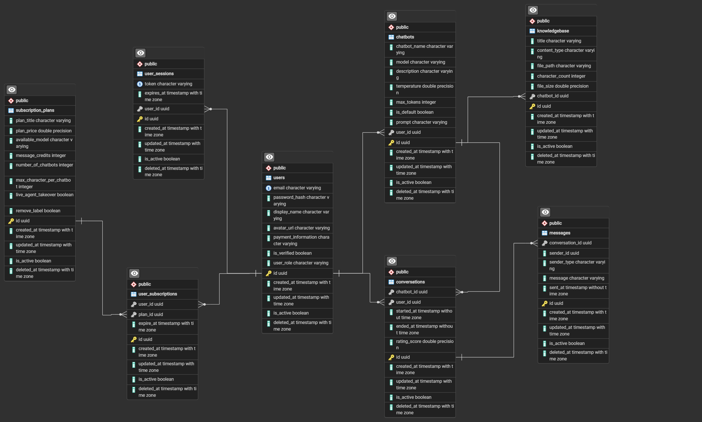

### Welcome everyone, this is the AI Assistant Chatbot project

##### ERD of the project



#### To start participating in the project, there are a few things to note:

##### 1. Everyone participating in this project should code according to the [Gitflow Workflow](https://viblo.asia/p/co-ban-ve-gitflow-workflow-4dbZNn6yZYM)

##### 2. Install Python's virtual environment manager

[Miniconda installation guide video](https://www.youtube.com/watch?v=R04snR6jl1s)

##### 3. Create a new virtual environment, install the necessary libraries, and run the project

###### `Create a new virtual environment and install the necessary libraries`

```terminal
conda create --name new_env_name python=3.9.6

conda activate new_env_name

conda install --file requirements.txt
```

###### `Run the project`

```terminal
uvicorn main:app --reload
```

##### 5. Project directory structure

```
📦Your-Project-Name
 ┣ 📂app
 ┃ ┣ 📂api
 ┃ ┃ ┣ 📂v1
 ┃ ┃ ┃ ┣ 📂endpoints
 ┃ ┃ ┃ ┗ 📜api.py
 ┃ ┃ ┗ 📜deps.py
 ┃ ┣ 📂common
 ┃ ┃ ┣ 📜client_filter.py
 ┃ ┃ ┣ 📜gen_date.py
 ┃ ┃ ┣ 📜generate.py
 ┃ ┃ ┣ 📜parameters.py
 ┃ ┃ ┣ 📜string_case.py
 ┃ ┃ ┗ 📜utils.py
 ┃ ┣ 📂core
 ┃ ┃ ┣ 📜config.py
 ┃ ┃ ┗ 📜oauth2.py
 ┃ ┣ 📂crud
 ┃ ┃ ┣ 📜base.py
 ┃ ┃ ┗ 📜crud_user.py
 ┃ ┣ 📂db
 ┃ ┃ ┣ 📜__init__.py
 ┃ ┃ ┣ 📜base_class.py
 ┃ ┃ ┣ 📜init_db.py
 ┃ ┃ ┣ 📜query_builder.py
 ┃ ┃ ┗ 📜session.py
 ┃ ┣ 📂models
 ┃ ┃ ┗ 📜user.py
 ┃ ┣ 📂schemas
 ┃ ┃ ┣ 📜auth.py
 ┃ ┃ ┣ 📜token.py
 ┃ ┃ ┗ 📜user.py
 ┃ ┣ 📂services
 ┃ ┃ ┣ 📜user_service_impl.py
 ┃ ┃ ┗ 📜user_service.py
 ┃ ┗ 📜main.py
 ┣ 📂docs
 ┃ ┗ 📜reference_links.md
 ┣ 📜.env
 ┣ 📜.gitignore
 ┣ 📜DML_scripts.ipynb
 ┣ 📜README.md
 ┗ 📜requirements.txt
```

###### `In which:`

- `app`: The main directory containing the source code of the project.
- `api`: Contains files related to the application's API.
- `v1`: Version 1 of the API.
- `endpoints`: Contains the endpoints of the API.
- `api.py`: File containing the API routes.
- `deps.py`: File containing the API dependencies.
- `common`: Contains common utilities and functions.
- `core`: Contains configuration and authentication files.
- `crud`: Contains functions for Create, Read, Update, Delete (CRUD) operations for objects in the project.
- `db`: Contains files related to the database.
- `models`: Contains files defining objects in the database.
- `schemas`: Contains files defining the schemas of objects in the project.
- `services`: Contains files implementing business logic.
- `docs`: Contains documents related to the project.
- `.env`: File containing environment variables. (.gitignore)
- `DML_scripts.ipynb`: File containing scripts for creating tables and sample data.
- `requirements.txt`: File containing necessary libraries for the project.
